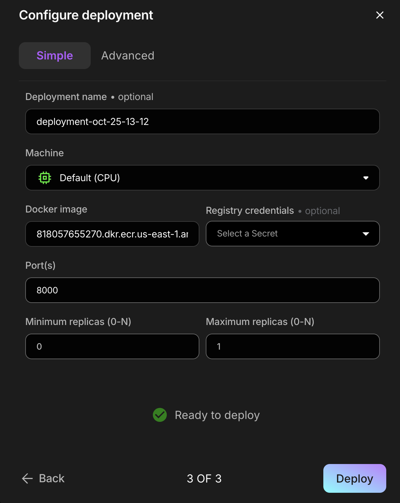
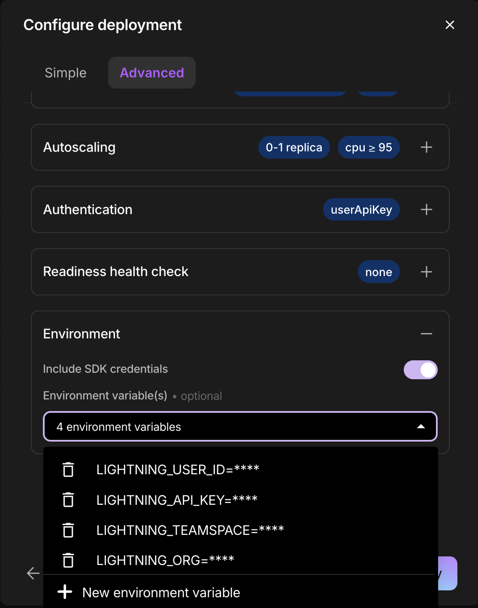

# Steps

## 1. Install requirements.txt

```bash
pip install -r requirements.txt
```

## 2. Upload the model files

```bash
python upload.py
```

## 2. Create Dockerfile

```bash
litserve dockerize server.py --port 8000
```

## 3. Build and push the docker image to ECR

```bash
sh build_and_push.sh
```

## 4. Get the image name

```bash
echo $AWS_ACCOUNT_ID.dkr.ecr.$LIGHTNING_CLUSTER_PRIMARY_REGION.amazonaws.com/litserve-model:latest
```

## 5. Create a new deployment

Enter the Docker Image and the Port 8000.



In the `Advanced section`, expand `Environnement` and toggle on `Include SDK credentials`.




## 6. Replace [DEPLOYMENT_NAME] in `deployment_client.py` and run it !

```python
from lightning_sdk.deployment import Deployment

deployment = Deployment(name="[DEPLOYMENT_NAME]")
resp = deployment.post("/predict", json={"text": ["I am quite happy today", "I am quite sad today"]})
print(resp.text)
```

